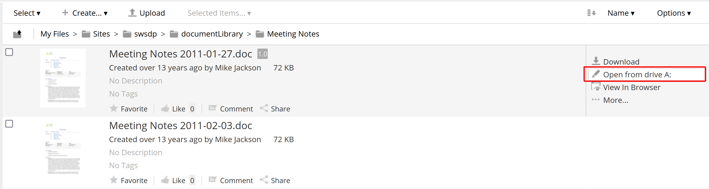

# Open document in default Windows application from mapped drive

⚠️ **Warning:** The repository is not completed.

Open locally addon add button into Document Actions which provide a link of the document to local drive A: The protocol in the link allows to open the document of any mimetype, registered in local client machine with default application.

## Using

## Packaging

You may pack it with maven. Go into the directory that you unzipped, or cloned via git:

    $ git clone https://github.com/sergefedorow/alfresco-share-open-locally-addon
    $ cd alfresco-share-open-locally-addon
    $ mvn clean
    $ mvn package -DskipTests=true

You will generate an Alfresco Share AMP package in the target directory. 

## Installation

### Install module on the server

Install AMP module into Share application. Read Alfresco documentation on how to install AMP.

### On the clients Windows machines

1. In Windows register the 'open-locally' protocol and add a protocol handler (not provided here).

2. Map network drive A: to http://<your.alfresco.domain>/alfresco/aos
3. Optionaly. Configure client browser to apply protocol from your Alfresco server and run the handler without annoying warnings or messages.

## Authors
 * Patricia Yague (forked source)
 * Cesar Capillas (forked source)
 * Serge Fedorow
